# PasswordGenerator
* [Deployed Site](https://segh.github.io/PasswordGenerator)
* [My GitHub](https://github.com/SEGH)

## Description
This is an application with the purpose of generating random passwords based on a user's input of length and selection of character types. It runs in the browser with a responsive user interface that adapts to most screen sizes. It is structured so that character types can be easily added, edited, or removed by editing the objects in the character array should the application need to be adapted to include other types of characters.

## Usage
* When the "Generate a Password" button is pressed, the application uses a prompt to have the user input a number that will define the length of their password. 
* If the user selects Cancel, nothing is displayed. 
* If the user selects OK with invalid information, an alert is given reminding the user that the input must be a number >= 8 and <= 128. 
* If the user enters a valid number, the application then runs a confirm function for each character type in the character array. 
* If the user does not confirm OK for any of the possible character types, an alert informs the user that they must select at least one and automatically loops through the character types again. 
* For each character type the user selects, an array of those characters is concatenated to a total selection array. 
* From that array, characters are chosen using their index that is randomly selected in a for loop that runs for the length of the password. 
* The password is then displayed as the value of the textarea of the html.

### Examples of responsive interface and results based on criteria selected:
### 375px
Length of 8 characters entered, no selection alert, lowercase confirmed on second pass
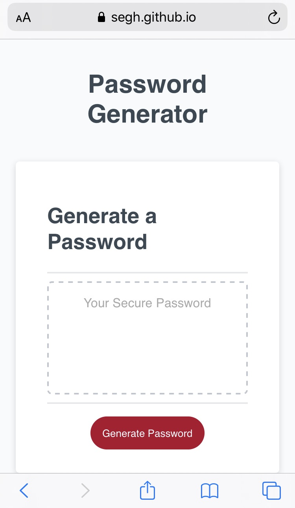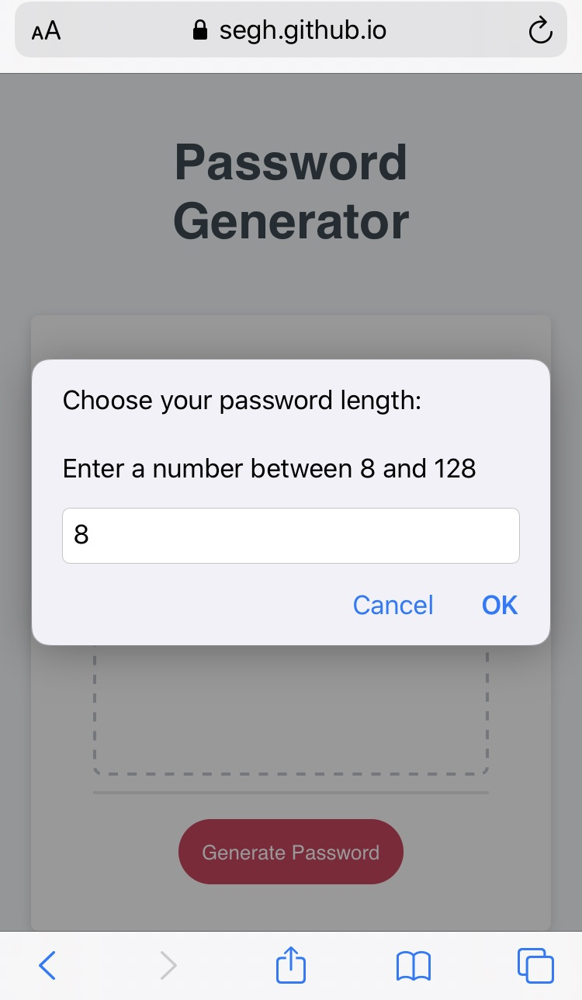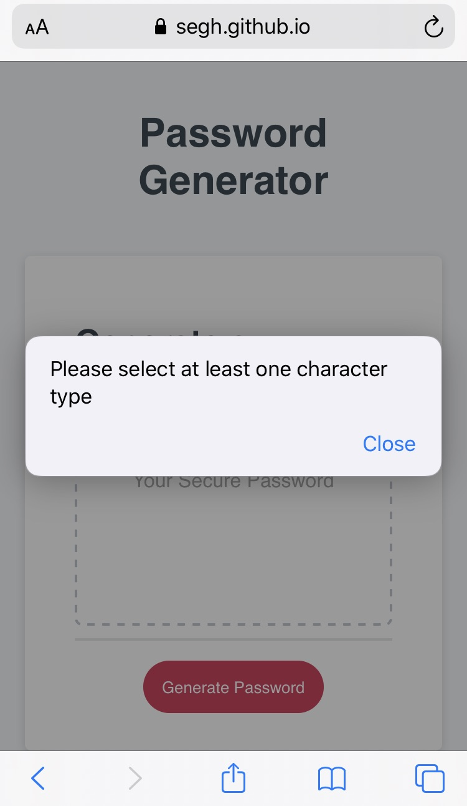 
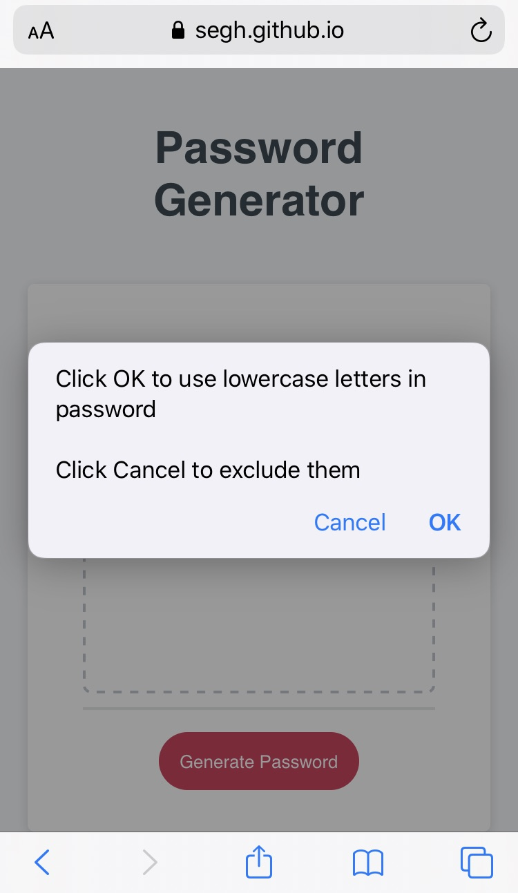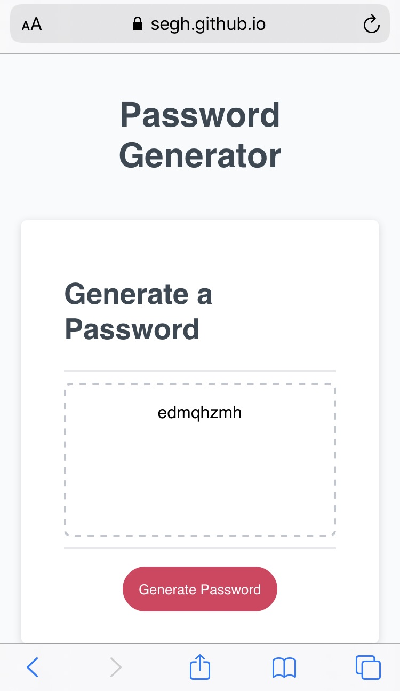
------

### 768px
Length of 60 entered, uppercase and special characters confirmed
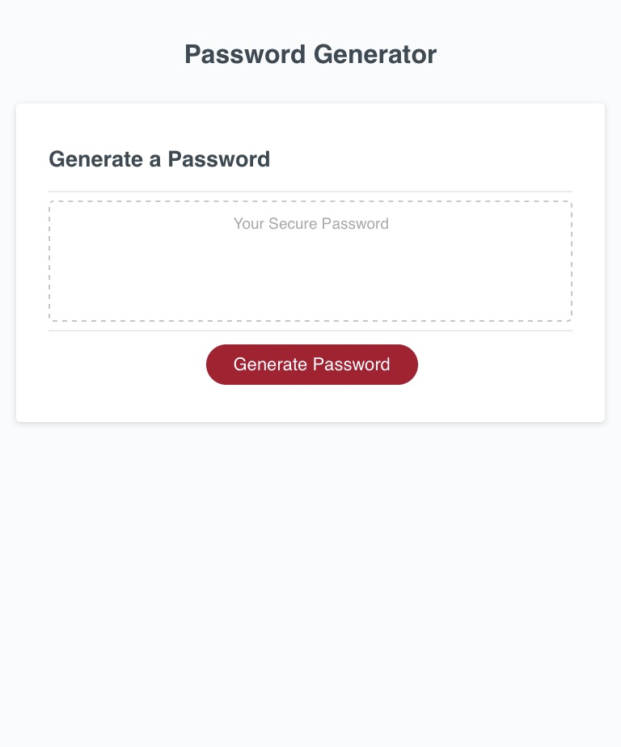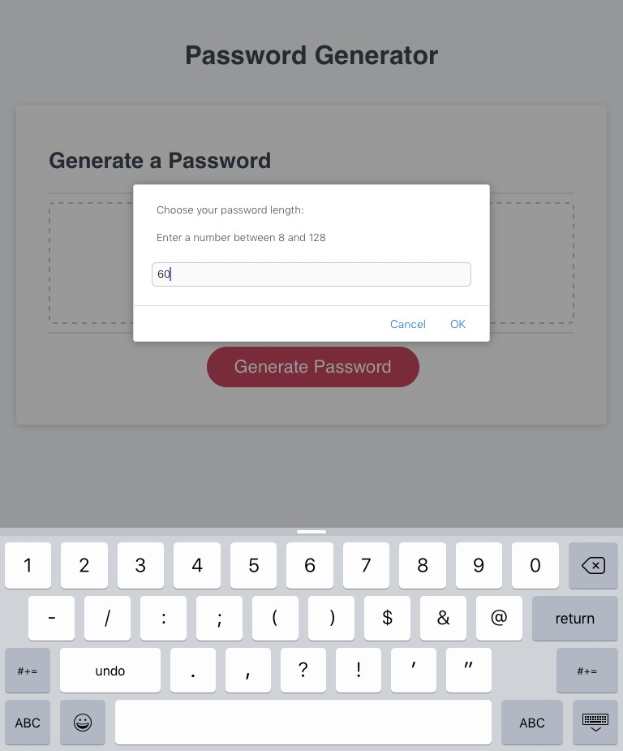
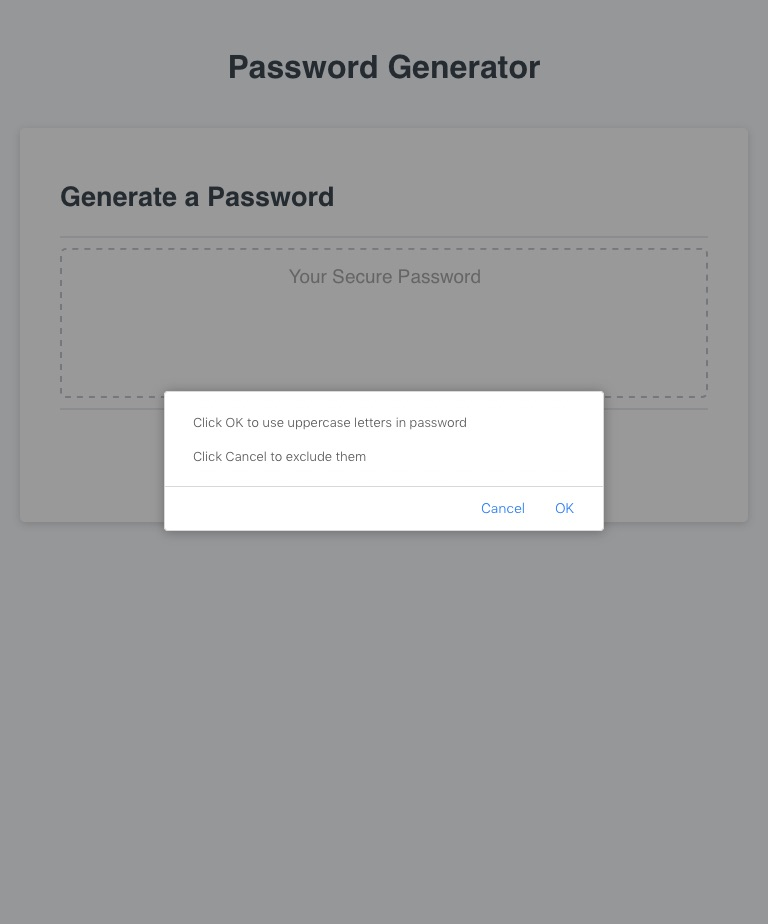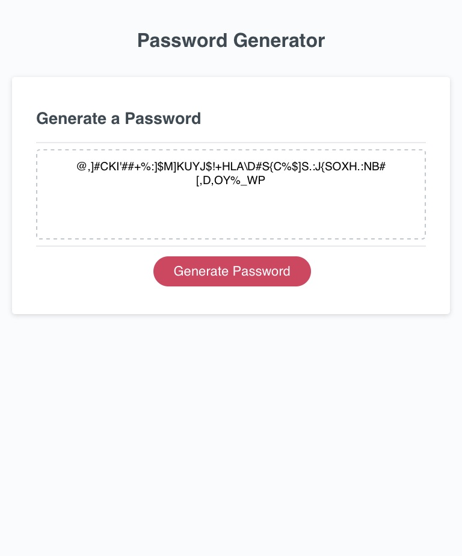
------

### 980px
Length of 128 entered, lowercase and numbers confirmed
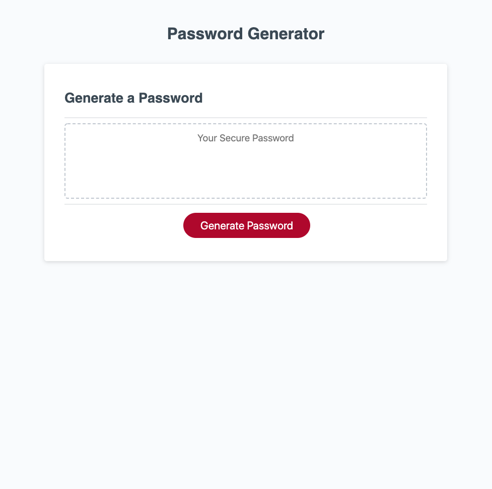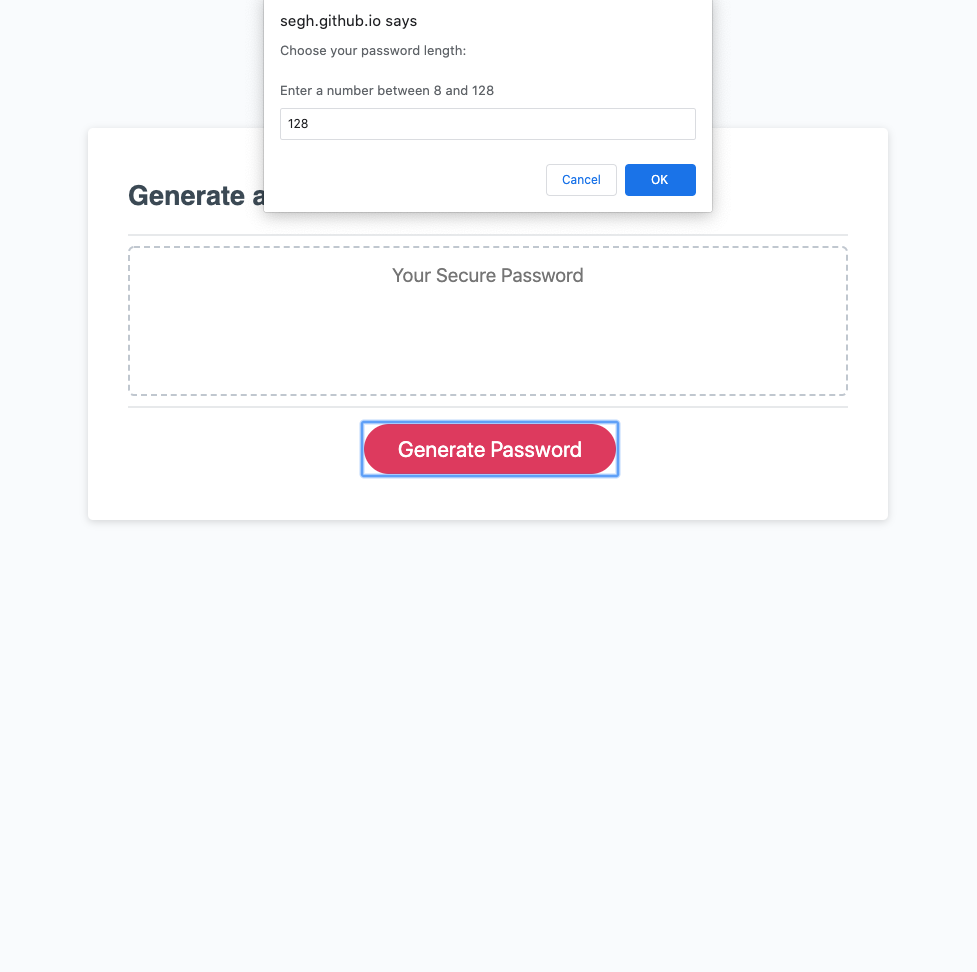
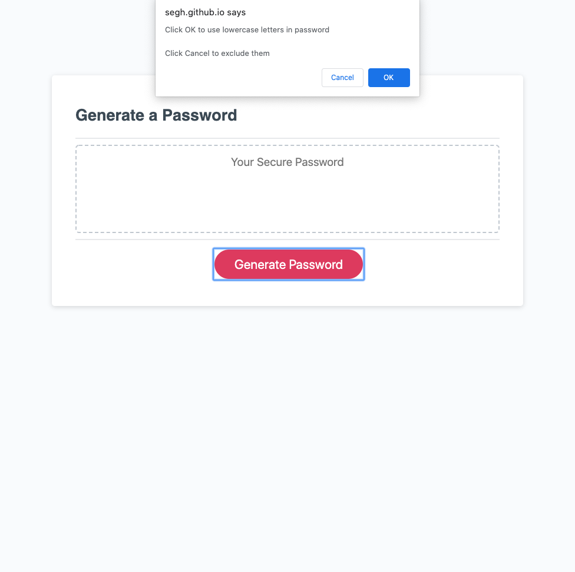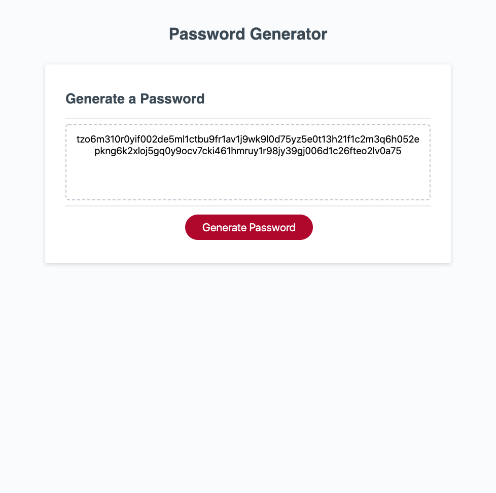